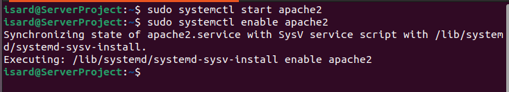
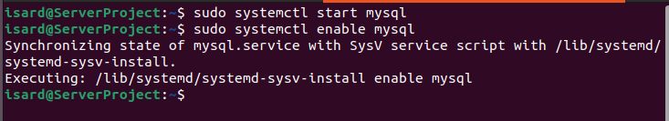

# Activaciones

Es necesario habilitar el apache2 y el mysql para poder hacer uso de ellos

## Configuracion post instalación

sudo systemctl start apache2
sudo systemctl enable apache2

sudo systemctl start mysql
sudo systemctl enable mysql

