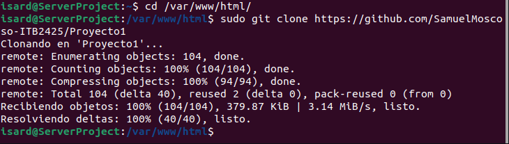
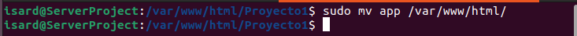

# Creación

---

## Clonacion

Deberemos de clonar nuestro repositorio del git en la carpeta html

sudo git clone (repositorio) (/var/www/html)
cd /var/www/html

---

## Base de datos

Crearemos la base de datos con el mysql

---
