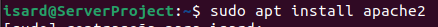
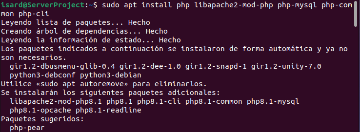
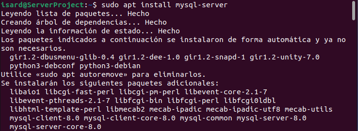
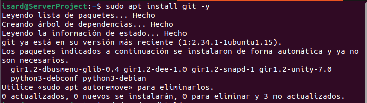

# Instalaciones de los programas requeridos para el proyecto

## Intalación del apache

sudo apt install apache2

## Instalación del php y requeridos

## Instalación del mysql

## Instalación del git 

