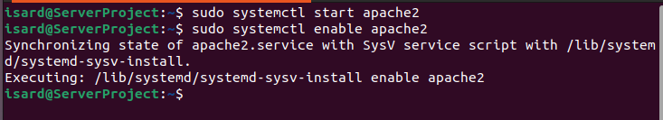

# Proyecto1

## Instalaciones de los programas requeridos

sudo apt update 

sudo apt install apache2

Instalacion del php y requeridos

sudo apt install mysql-server

Configuracion post instalación

sudo systemctl start apache2
sudo systemctl enable apache2

sudo systemctl start mysql
sudo systemctl enable mysql

## Instalacion del git

sudo apt install git -y

sudo git clone (repositorio) (/var/www/html)
cd /var/www/html

Se le ha de dar parmisos al 
sudo chown -R www-data:www-data app
sudo chown 755 app

## Base de datos

Crearemos la base de datos con el mysql

Mysql

CREATE DATABASE crud_db CHARACTER SET utf8mb4 COLLATE utf8mb4_unicode_ci;

USE crud_db;

CREATE TABLE users (
    id INT AUTO_INCREMENT PRIMARY KEY,
    name VARCHAR(100) NOT NULL,
    email VARCHAR(100) NOT NULL
);

## Web
Para poder entrar en la web tendremos que usar el 
http://192.168.50.1/app/dbtest.php

