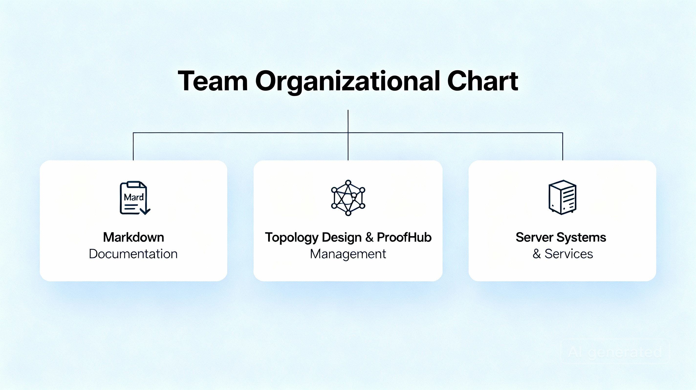

<!-- 4. PLANIFICACIÓN Y ROLES -->

# 4. Planificación y Roles

> La planificación adecuada y la asignación clara de roles son la clave para el éxito de cualquier proyecto. Esta sección detalla la estructura organizativa, funciones y responsables en el proyecto de infraestructura IT.

---

## 👥 Estructura del Equipo

| Rol                        | Responsable        | Función principal                                    | Contacto            |
|----------------------------|--------------------|-----------------------------------------------------|---------------------|
| **Jefe de Proyecto**       | [Nombre]           | Coordinación general, supervisión y comunicación   | jefe@example.com    |
| **Responsable de Sistemas**| [Nombre]           | Instalación y configuración de servidores y servicios | sistemas@example.com|
| **Responsable de Red**     | [Nombre]           | Diseño de topología, configuración de router y seguridad | red@example.com     |
| **Responsable de Documentación** | [Nombre]     | Gestión de documentación en Markdown y repositorio GitHub | doc@example.com     |

---

## 🗓️ Organización por Sprints

Nuestro proyecto se divide en **sprints quinquenales** de 10 horas cada uno, para asegurar avances constantes y entregables claros. La planificación de tareas por sprint es esencial para mantener el ritmo y la calidad del proyecto.

---

## 📊 Matriz RACI (Responsable, Aprobador, Consultado, Informado)

| Actividad                  | Responsable     | Aprobador       | Consultado      | Informado       |
|----------------------------|-----------------|-----------------|-----------------|-----------------|
| Diseño de la Topología     | Responsable de Red | Jefe de Proyecto | Equipo sistemas | Todo el equipo  |
| Despliegue de Servidores   | Responsable de Sistemas | Jefe de Proyecto | Responsable de Red | Todo el equipo  |
| Gestión de Documentación   | Responsable de Documentación | Jefe de Proyecto | Todos           | Todo el equipo  |
| Pruebas y Validación       | Responsable de Sistemas | Jefe de Proyecto | Responsable de Red | Todo el equipo  |

---

## 🖼️ Visualización del Equipo y Roles

---

<a href="./requisitos.md">⏪ Página anterior</a>

<a href="./despliegue.md">⏩ Siguiente página</a>

