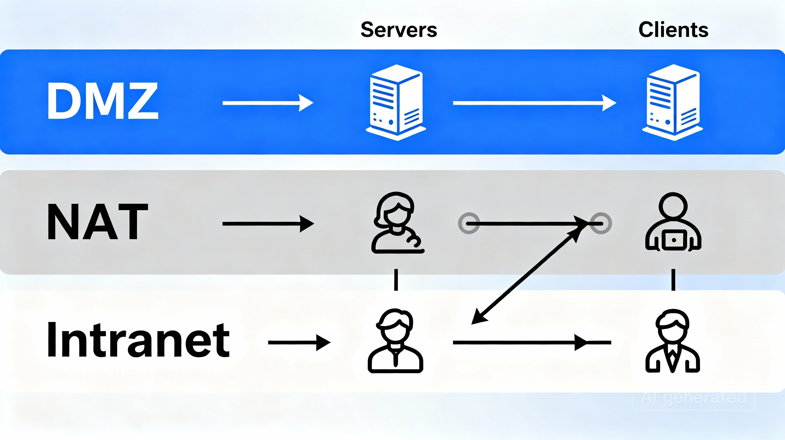

<!-- 2. REQUISITOS Y ALCANCE -->

# 2. Requisitos y Alcance

> En esta sección se definen las condiciones y objetivos técnicos necesarios para la correcta implementación de la infraestructura IT, asegurando funcionalidad, seguridad y documentación.

---

## ✔️ Servicios a instalar y configurar

- **Web:** Servidor HTTP para publicación de contenido y gestión de aplicaciones.
- **SSH:** Acceso remoto seguro para administración y control.
- **MySQL:** Motor de base de datos para almacenamiento y consultas.
- **DHCP:** Asignación dinámica de direcciones IP en red.
- **DNS:** Resolución de nombres para direccionamiento de servicios y equipos.
- **FTP:** Protocolo para transferencia de archivos entre servidores y clientes.

---

## 🌐 Zonas de red a montar y probar

- **DMZ:** Zona desmilitarizada para servidores expuestos a internet con seguridad específica.
- **NAT:** Traducción de direcciones para conexiones externas.
- **Intranet:** Red interna segura destinada a usuarios y equipos corporativos.

---

## 🖥️ Equipamiento

| Tipo           | Cantidad | Descripción                          |
|----------------|----------|------------------------------------|
| Servidores     | 2        | Máquinas físicas para servicios    |
| Estaciones     | 2        | Windows y Linux como clientes      |

---

## 📚 Documentación y control de versiones

- Toda la información y configuraciones se documentarán en formato **Markdown**.
- El contenido se almacenará y gestionará en un repositorio **GitHub** para control de versiones, accesibilidad y colaboración.

---

## 📊 Manejo de datos externos

- Se importará correctamente el conjunto de datos del [equipamiento educativo de Barcelona](https://opendata-ajuntament.barcelona.cat/data/es/dataset/equipaments-educacio) en la base de datos para su consulta y análisis.

---

## 🔒 Especificaciones de seguridad y conectividad

- Garantizar acceso controlado con usuarios específicos.
- Configurar correctamente políticas de seguridad para servicios y segmentos de red.
- Probar la conectividad entre las distintas zonas y servicios.

---

<a href="./objetivos.md">⏪ Página anterior</a>

<a href="./planificacion.md">⏩ Siguiente página</a>

